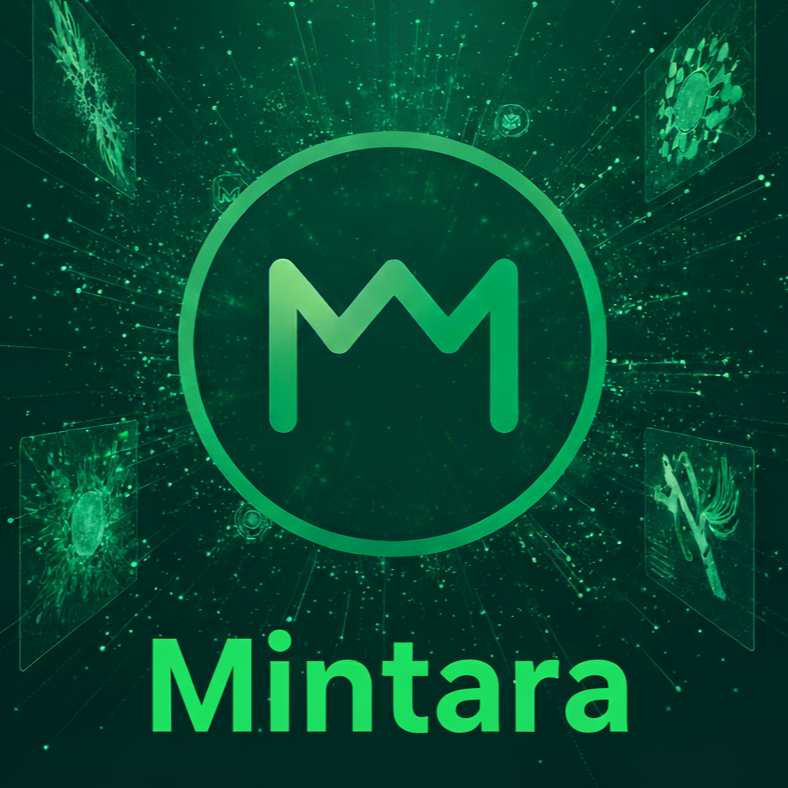

# Mintara Base - Token & NFT Builder Platform



## Overview

Mintara Base is a no-code platform for creating ERC20 tokens and AI-generated NFTs on the Base Network. Build, mint, and manage your Web3 assets without writing a single line of code.

## Features

### Token Builder
- Create custom ERC20 tokens on Base Network
- Optional mint/burn capabilities
- Real-time blockchain deployment
- Automatic wallet integration

### AI NFT Builder
- Generate unique NFT artwork using AI (Pollinations FLUX)
- Mint NFT collections on Base Network
- Customizable metadata and attributes
- Instant minting and wallet delivery

### Advanced Features
- **NFT Gallery**: View and manage your NFT collections
- **Dashboard**: Track all your tokens and NFTs in one place
- **Liquidity Pool Creator**: Create liquidity pools on Base DEXs
- **Airdrop Tool**: Distribute tokens to multiple wallets via CSV
- **Token Vesting**: Create vesting schedules with cliff periods

## Technology Stack

- **Frontend**: React 19 + Vite + TypeScript
- **Styling**: Tailwind CSS v4
- **Wallet**: RainbowKit 2.2+ (40+ wallet support)
- **Web3**: wagmi 2.15+ & viem 2.25+
- **Blockchain**: Base Network (Chain ID: 8453)
- **AI**: Pollinations API (FLUX model)

## Smart Contracts

- **Token Factory**: `0x8384442FA9384F6276Cf175F8EB48c737ee204a6`
- **NFT Factory**: `0x56ba49A2a1fcd316B92355B1ccc12638cC1EefA8`
- **Base USDC**: `0x833589fCD6eDb6E08f4c7C32D4f71b54bdA02913`

## Fee Structure

All platform fees are paid in USDC on Base Network:
- Token Creation: 1 USDC
- NFT Minting: 1 USDC
- Fees go to: `0x71DEdF5544692aF64FC2ce040a2b3dA573957275`

## Getting Started

### Prerequisites

- Node.js 20+
- npm or pnpm
- MetaMask, Rainbow, or any Web3 wallet
- Base Network setup in your wallet
- USDC on Base Network for platform fees

### Installation

```bash
# Clone the repository
git clone https://github.com/2025mintara/Mintara.git
cd Mintara

# Install dependencies
npm install --legacy-peer-deps

# Start development server
npm run dev
```

### Build for Production

```bash
npm run build
```

Output will be in the `build/` directory.

## Environment Variables

Create a `.env` file with:

```env
DEPLOYER_PRIVATE_KEY=your_private_key
HUGGINGFACE_API_KEY=your_huggingface_key (optional)
VITE_ONCHAINKIT_API_KEY=your_coinbase_key (optional)
```

## Deployment

### Vercel (Recommended)

1. Push to GitHub
2. Import project in Vercel
3. Configure build settings:
   - **Framework**: Vite
   - **Build Command**: `npm run build`
   - **Output Directory**: `build`
   - **Install Command**: `npm install --legacy-peer-deps`
4. Add environment variables
5. Deploy!

## Supported Wallets

- Rainbow Wallet
- MetaMask
- Coinbase Wallet
- WalletConnect (all mobile wallets)
- Trust Wallet
- Phantom
- Ledger
- And 30+ more via RainbowKit

## Base App Integration

This project includes Farcaster MiniApp manifest at `/.well-known/farcaster.json` for seamless integration with Base App.

## Contributing

Contributions are welcome! Please feel free to submit a Pull Request.

## License

MIT License - see LICENSE file for details.

## Support

For support, please open an issue on GitHub or contact the team.

---

Built with ❤️ on Base Network
